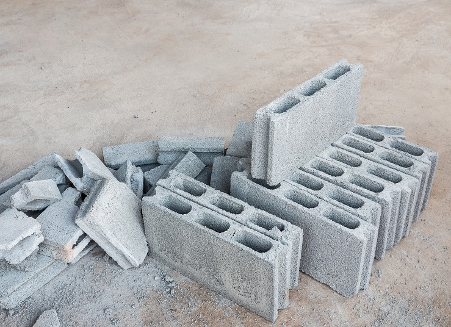

Data Science Dojo  
Copyright (c) 2016 - 2019

---

**Level:** Intermediate  
**Recommended Use:** Regression Models 
**Domain:** Civil Engineering/Construction  

## Concrete Compressive Strength Data Set 

### Estimate compressive strength of concrete 

---

---

This *intermediate* level data set has 1030 rows and 9 columns.
Concrete is the most important material in civil engineering. The concrete compressive strength is a highly nonlinear function of age and ingredients
The actual concrete compressive strength (MPa) for a given mixture under a specific age (days) was determined from laboratory. Data is in raw form (not scaled).
 
This data set is recommended for learning and practicing your skills in **exploratory data analysis**, **data visualization**, and **regression modelling techniques**. 
It also allows you to practice with non-linear functions. Feel free to explore the data set with multiple **supervised** and **unsupervised** learning techniques. The Following data dictionary gives more details on this data set:

---

### Data Dictionary 

| Column   Position 	| Atrribute Name                                         	| Definition                                                                    	| Data Type    	| Example                              	| % Null Ratios 	|
|-------------------	|--------------------------------------------------------	|-------------------------------------------------------------------------------	|--------------	|--------------------------------------	|---------------	|
| 1                 	| Cement (component 1)(kg in a m^3 mixture)              	| Cement   (component 1) -- Kilogram in a meter-cube mixture -- Input Variable  	| Quantitative 	| 194.68, 379.5, 167.95                	| 0             	|
| 2                 	| Blast Furnace Slag (component 2)(kg in a m^3 mixture)  	| Blast Furnace   Slag (component 2) -- kg in a m3 mixture -- Input Variable    	| Quantitative 	| 0, 151.2, 42.08                      	| 0             	|
| 3                 	| Fly Ash (component 3)(kg in a m^3 mixture)             	| Fly Ash   (component 3) -- kg in a m3 mixture -- Input Variable               	| Quantitative 	| 100.52, 0, 163.83                    	| 0             	|
| 4                 	| Water  (component 4)(kg in a m^3   mixture)            	| Water   (component 4) -- kg in a m3 mixture -- Input Variable                 	| Quantitative 	| 165.62, 153.9, 121.75                	| 0             	|
| 5                 	| Superplasticizer (component 5)(kg in a m^3 mixture)    	| Superplasticizer   (component 5) -- kg in a m3 mixture -- Input Variable      	| Quantitative 	| 7.48, 15.9, 5.72                     	| 0             	|
| 6                 	| Coarse Aggregate  (component 6)(kg   in a m^3 mixture) 	| Coarse   Aggregate (component 6) -- kg in a m3 mixture -- Input Variable      	| Quantitative 	| 1006.4, 1134.3, 1058.7               	| 0             	|
| 7                 	| Fine Aggregate (component 7)(kg in a m^3 mixture)      	| Fine Aggregate   (component 7) -- kg in a m3 mixture -- Input Variable        	| Quantitative 	| 905.9, 605, 780.11                   	| 0             	|
| 8                 	| Age (day)                                              	| Age -- Day   (1-365) -- Input Variable                                        	| Quantitative 	| 56, 91, 28                           	| 0             	|
| 9                 	| Concrete compressive strength(MPa, megapascals)        	| Concrete   compressive strength -- MegaPascals -- Output Variable             	| Quantitative 	| 33.96358776, 56.49566344, 32.8535314 	| 0             	|

---

### Acknowledgement

This data set has been sourced from the Machine Learning Repository of University of California, Irvine [Concrete Compressive Strength Data Set (UC Irvine)](https://archive.ics.uci.edu/ml/datasets/Concrete+Compressive+Strength). 
The UCI page mentions the following publication as the original source of the data set:

*I-Cheng Yeh, "Modeling of strength of high performance concrete using artificial neural networks," Cement and Concrete Research, Vol. 28, No. 12, pp. 1797-1808 (1998)*

